# FresnoStateBuyNSell

***
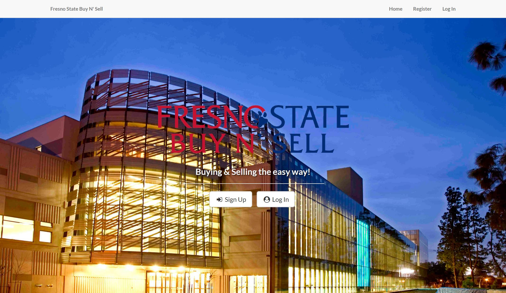

Fresno State Buy N' Sell is an account based web application for Fresno State students to buy and sell their educational items (such as textbooks, computers, etc.) to and from each other to save money in an easy and safe way.  To ensure security, registration is limited to students with a Fresno State email domain and emails must be verified before users can access the site. Additionally, three failed login attemps in succession will place a temporary lock on user accounts to protect them. Users also can rate each other to help them determine who is reliable and safe.  For a user friendly experience, features such as password reset via email; searching, sorting, and filtering items; and comment sections for asking questions have been implemented.

 

## Features
***
### Register
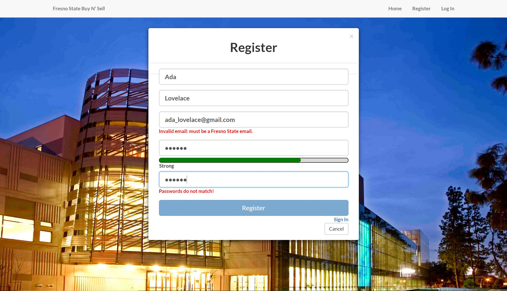

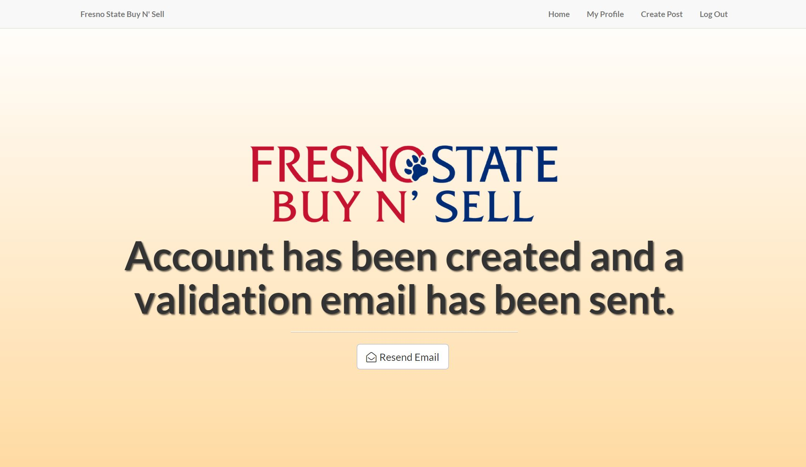

### Reset Password
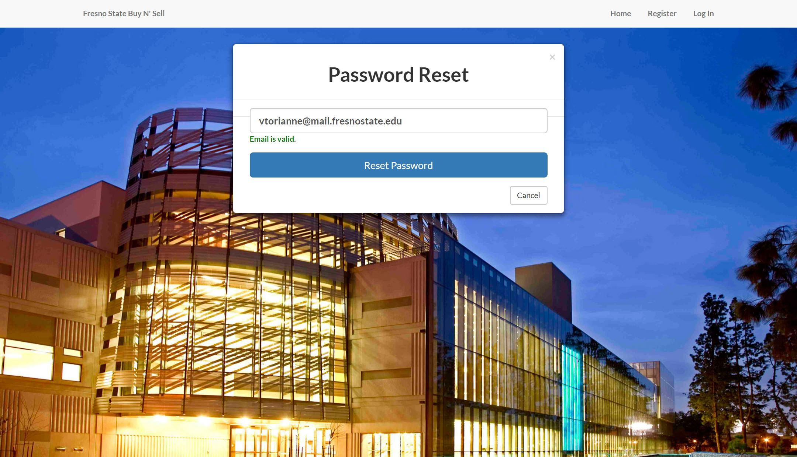

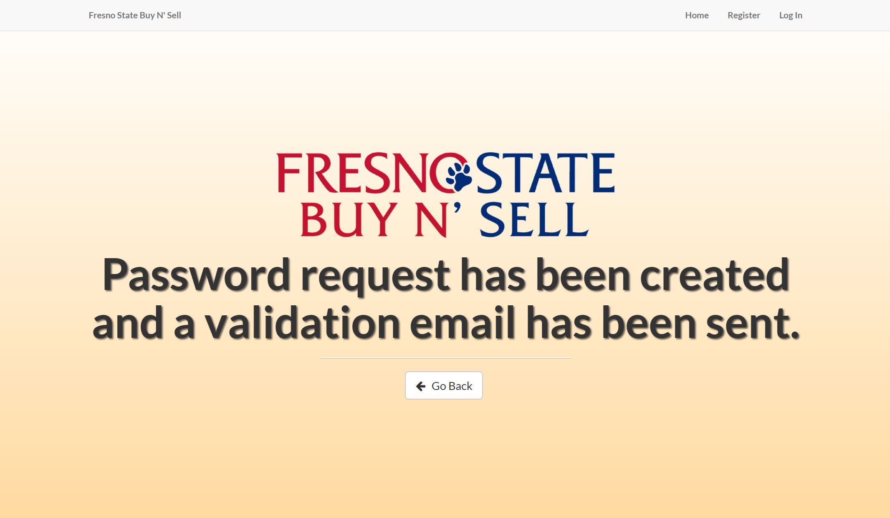

### Sell Items
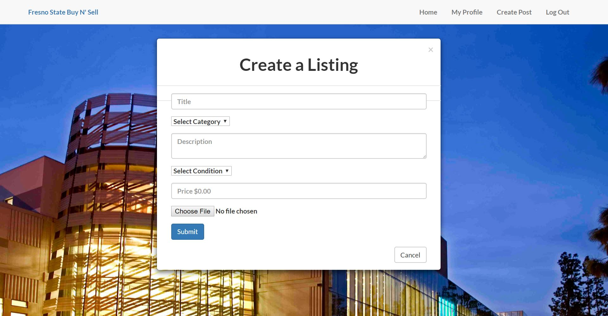

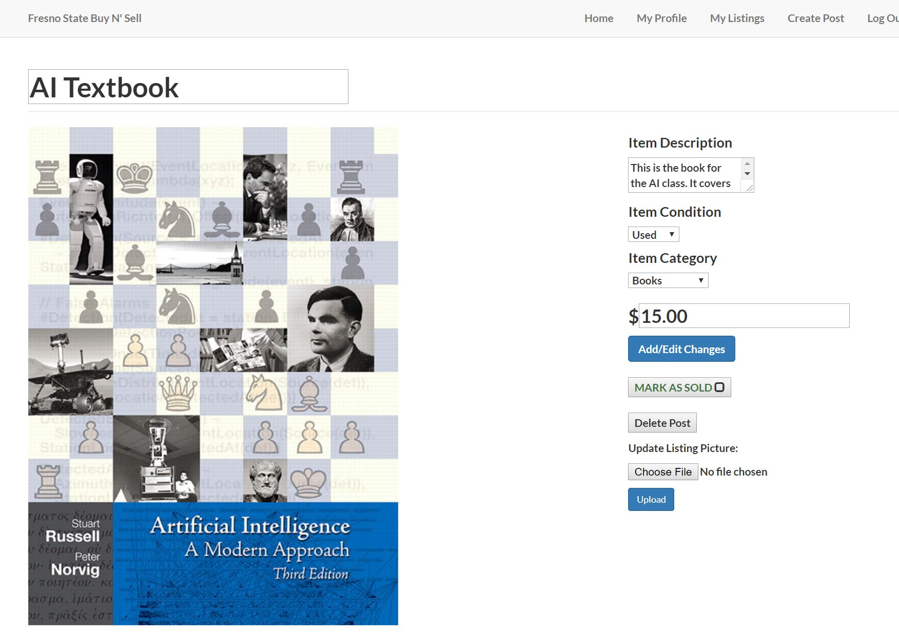

### Buy Items
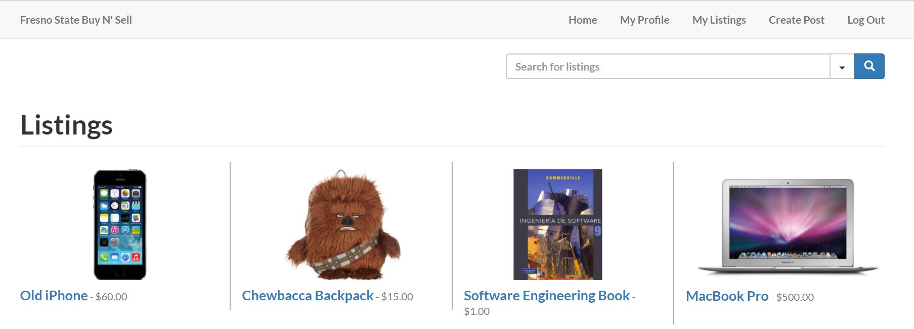

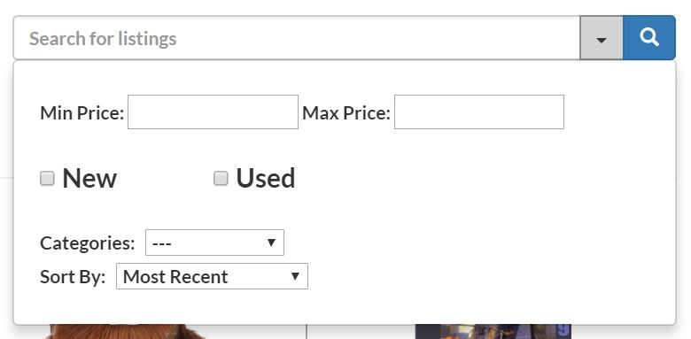

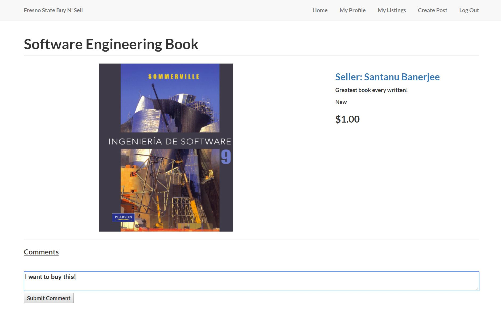

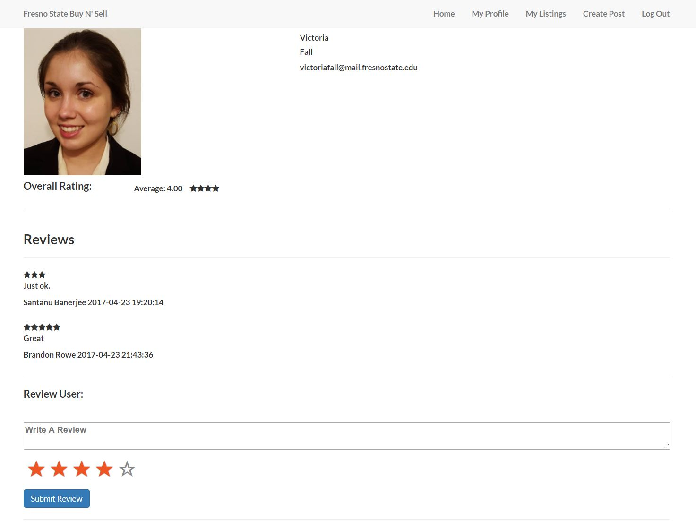

 

## Architecture
***
### Use Case Diagram
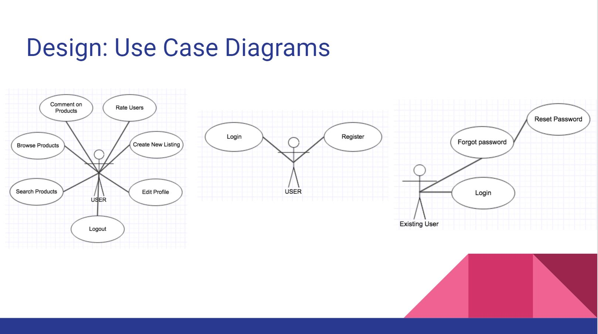

### MVC Pattern
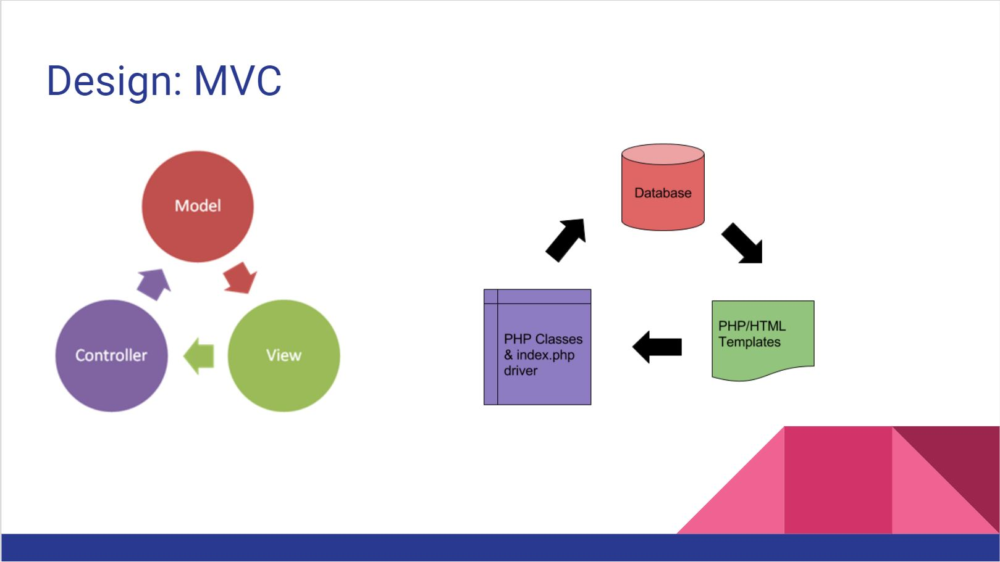

### Class Diagram
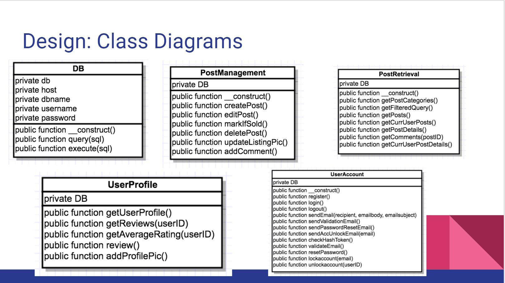

### Database Schema
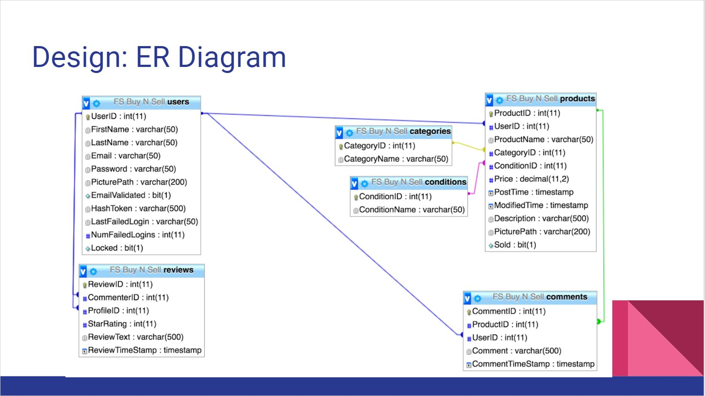

 

## Team Members
***
Member | Roles
 --- | ---  
Carlos Daccarett | Fullstack Developer
Johnathan Hill | Frontend Developer, Browser Support and User Tester
Brandon Rowe | Backend Developer, Database Admin
Victoria Fall | Project Manager, Fullstack Developer, Unit Tester
